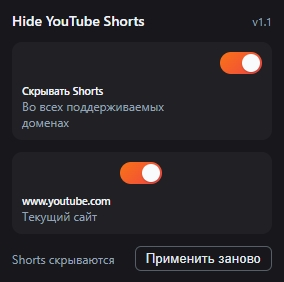

# Hide YouTube Shorts

Hide YouTube Shorts is a minimalist Manifest V3 extension that instantly hides every YouTube Shorts element on `youtube.com` and `m.youtube.com` without flicker or breaking the rest of the site. It tracks Polymer SPA updates and clears newly injected Shorts automatically.

## Features

- Removes Shorts shelves from the home feed and recommendations
- Hides the “Shorts” entry in the main and mini navigation menus
- Keeps Shorts away during SPA navigation and infinite scroll
- Works for desktop and mobile (m.youtube.com) layouts
- Popup with global toggle and per-domain override
- Clean icon set (color when active, grey when disabled)

## Installation (Chrome / Chromium / Edge)

1. Clone or download the repository:
   ```bash
   git clone https://github.com/<your-account>/hide-youtube-shorts.git
   ```
2. Open `chrome://extensions` (or `edge://extensions`).
3. Enable **Developer mode**.
4. Click **Load unpacked** and select the `hide-youtube-shorts` folder.
5. Refresh any open YouTube tabs.

_The same steps work for Brave, Vivaldi, and other Chromium-based browsers._

## Usage

- Click the extension icon to open the popup.
- **Hide Shorts** toggle controls filtering globally. When it is off, the icon turns grey and Shorts reappear everywhere.
- **Current site** toggle shows up on `www.youtube.com` and `m.youtube.com`. It lets you allow Shorts just for that domain.
- **Run cleanup again** button triggers an immediate DOM sweep without reloading the page.
- All preferences persist in `chrome.storage` across browser restarts.

## Project Structure

```
hide-youtube-shorts/
├─ manifest.json        # Manifest V3 configuration
├─ background.js        # Service worker: settings, icon updates
├─ content.js           # Content script: DOM cleanup + SPA hooks
├─ hide-shorts.css      # Early CSS to suppress Shorts instantly
├─ popup.html/.css/.js  # Popup UI and behaviour
├─ icons/               # Active/inactive icons (16/48/128 px)
├─ README.md
└─ LICENSE (MIT)
```

## FAQ

- **I see a brief flash.** Make sure the extension is active and no other scripts override the display later. Press “Run cleanup again” or hard refresh (`Ctrl+F5`).
- **Shorts came back after a site update.** Inspect the new DOM in DevTools, add matching selectors to `content.js`/`hide-shorts.css`, then reload the extension.
- **I only want Shorts on one account.** Disable the global toggle or switch the current domain toggle to Off for the channels where you need Shorts.

## License

Released under the [MIT](LICENSE) license.

---

# Hide YouTube Shorts (RU)

Hide YouTube Shorts — минималистичное расширение Manifest V3, которое мгновенно скрывает все элементы Shorts на `youtube.com` и `m.youtube.com` без мерцаний и ломки остальных частей сайта. Расширение отслеживает SPA-обновления и автоматически чистит DOM от новых Shorts.

## Возможности

- Удаляет полки Shorts с главной страницы и из рекомендаций
- Прячет пункт «Shorts» в основном и мини-меню
- Поддерживает SPA-навигацию и бесконечную прокрутку, не возвращая Shorts
- Работает для десктопной и мобильной версий (m.youtube.com)
- Popup с глобальным переключателем и исключением для текущего домена
- Статусный значок (цветной при активном режиме, серый при выключенном)

## Установка (Chrome / Chromium / Edge)

1. Склонируйте или скачайте репозиторий:
   ```bash
   git clone https://github.com/<your-account>/hide-youtube-shorts.git
   ```
2. Откройте `chrome://extensions` (в Edge — `edge://extensions`).
3. Включите **Developer mode**.
4. Нажмите **Load unpacked** и выберите папку `hide-youtube-shorts`.
5. Обновите вкладку YouTube.

_В Brave, Vivaldi и других Chromium-браузерах процедура такая же._

## Использование

- Нажмите иконку расширения, чтобы открыть popup.
- Переключатель **«Hide Shorts»** (Скрывать Shorts) управляет фильтрацией глобально. При выключении иконка сереет, а Shorts возвращаются.
- Блок **«Current site»** (Текущий сайт) появляется на `www.youtube.com` и `m.youtube.com`, позволяя включать Shorts только для выбранного домена.
- Кнопка **«Run cleanup again»** (Применить заново) запускает мгновенную повторную очистку без перезагрузки страницы.
- Настройки сохраняются в `chrome.storage` и переживают перезапуск браузера.

## Структура проекта

```
hide-youtube-shorts/
├─ manifest.json        # Конфигурация Manifest V3
├─ background.js        # Service worker: хранение настроек, смена иконок
├─ content.js           # Контент-скрипт: очистка DOM и реакция на SPA
├─ hide-shorts.css      # CSS для мгновенного скрытия Shorts
├─ popup.html/.css/.js  # Интерфейс переключателей
├─ icons/               # Иконки активного/неактивного состояния
├─ README.md
└─ LICENSE (MIT)
```

## Вопросы и ответы

- **Появилось мерцание.** Проверьте, что расширение активно и нет скриптов, которые переопределяют `display`. Используйте «Применить заново» или `Ctrl+F5`.
- **Shorts вернулись после обновления YouTube.** Посмотрите DOM в DevTools, добавьте новые селекторы в `content.js` и `hide-shorts.css`, затем перезагрузите расширение.
- **Хочу оставить Shorts только в одном профиле.** Отключите глобальный переключатель или выключите фильтрацию для нужного домена.

## Лицензия

Проект распространяется по лицензии [MIT](LICENSE).
